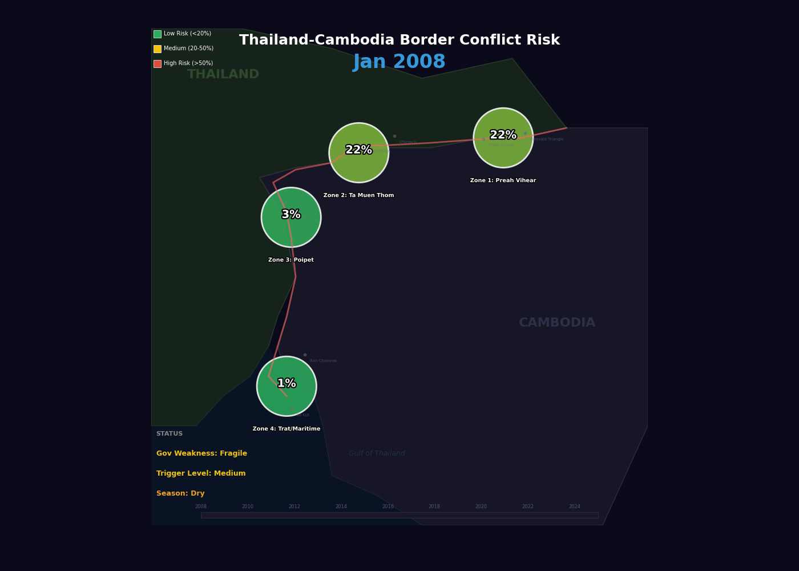

# Thailand–Cambodia Border Conflict Risk Model



## Overview

This project develops a probabilistic forecasting system for military escalation risk along the Thailand–Cambodia border. The model integrates political, institutional, economic, and geospatial indicators to estimate the probability of border conflict within a six-month window.

Using a Bayesian Network architecture, the system models how domestic political instability, bilateral tensions, and regional conditions interact to increase or decrease the likelihood of military confrontation.

The goal is to produce zone-level risk forecasts that help identify:

- Potential escalation hotspots
- Underlying political triggers
- Spatial patterns of risk along the border

This work is designed for research and analytical purposes in political risk, international security, and computational social science.

---

## Key Idea

The model is built around an empirical observation:

Major Thailand–Cambodia border escalations since 2008 tend to occur during periods of Thai civilian government weakness or political transition.

Political fragility acts as a central driver, while other variables serve as triggers or amplifiers that influence escalation dynamics.

---

## Geographic Prediction Zones

The border is divided into four operational zones, each with its own conflict history and contextual factors.

### Zone 1 — Northeast Dangrek

Key locations:

- Preah Vihear Temple
- Emerald Triangle
- Phu Makhua Hill
- Nam Yuen District

Characteristics:

- Mountainous terrain
- Strong dry-season effects
- Historical conflict hotspot

### Zone 2 — Western Dangrek

Key locations:

- Prasat Ta Muen Thom
- Ta Krabey
- Ta Khwai
- O'Smach

Characteristics:

- Highland terrain
- Significant cross-border criminal networks
- Frequent historical military tensions

### Zone 3 — Central Border

Key locations:

- Poipet / Sa Kaeo
- Serei Saophoan
- Prey Chan Village

Characteristics:

- Flat terrain
- Major commercial border crossing
- Strong influence from the regional scam economy

### Zone 4 — Southeast Coast / Maritime

Key locations:

- Ban Chamrak / Trat
- Thma Da / Pursat
- Khlong Yai
- Ko Kut

Characteristics:

- Maritime and coastal environment
- Naval and ground interaction dynamics
- Lower historical conflict frequency

---

## Model Architecture

The Bayesian Network is structured into three conceptual layers.

### 1. Structural Layer (Long-Term Conditions)

Updated annually and representing baseline political conditions.

Variables include:

- Military Autonomy
- Civilian Government Legitimacy
- Royalist–Military Bloc Cohesion
- Economic Stress

These variables determine the stability of the political system.

---

### 2. Trigger Layer (Short-Term Signals)

Updated weekly or event-driven.

Examples:

- Government survival probability
- Constitutional Court activity
- Military–civilian friction events
- Nationalist sentiment
- Cambodian provocation indicators
- Bilateral diplomatic channel health

These factors influence whether escalation pressures increase.

---

### 3. Output Layer

The model produces:

**P(Border Military Action within 6 Months)**

This probability is calculated for each geographic zone.

A central latent variable called **Government Weakness (Stable / Fragile / Collapsed)** mediates the relationship between structural factors and trigger events.

---

## Data Sources

### Thailand Structural Indicators

| Variable | Source |
|---|---|
| Military Autonomy | V-Dem Dataset |
| Government Legitimacy | NIDA Poll, IPU Parline |
| Royalist–Military Bloc Cohesion | iLaw dataset, court rulings |
| Economic Stress | Bank of Thailand, FRED |

### Cambodia Baseline Indicators

| Variable | Source |
|---|---|
| Regime Consolidation | V-Dem Dataset |
| Violence Capacity | V-Dem Dataset |
| Corruption Environment | V-Dem Dataset |

### Trigger Layer Signals

| Variable | Source |
|---|---|
| Conflict Events | ACLED |
| Court Activity | Thai Constitutional Court |
| Nationalist Sentiment | Twitter / news media |
| Cambodian Provocation | Sentinel-2 satellite imagery |
| Bilateral Channels | Thai MFA / Cambodian MFA |
| Scam Economy Indicators | OFAC sanctions, UNODC |

---

## Installation

### Requirements

- Python 3.9+
- pgmpy
- pandas
- numpy

### Clone the Repository

```bash
git clone https://github.com/Eshih0/MAJIC_Group1.git
cd MAJIC_Group1
```

### Create Virtual Environment

```bash
python -m venv venv
source venv/bin/activate
```

### Install Dependencies

```bash
pip install -r requirements.txt
```

---

## Data Setup

The V-Dem dataset is too large to include directly in the repository.

1. Download the **Country-Year V-Dem dataset**
2. Select:

```
Country-Year: V-Dem Full + Others
```

3. Place the file in:

```
data/V-Dem-CY-Full+Others-v15.csv
```

---

## Usage

### 1. Extract and Discretize V-Dem Data

```bash
cd src
python vdem_extract.py
```

Outputs:

```
thailand_values.csv
cambodia_values.csv
```

These contain both raw scores and discretized states.

---

### 2. Generate Bloc Cohesion Data

```bash
python bloc_cohesion_extract.py
```

Output:

```
data/training/bloc_cohesion.csv
```

This dataset includes:

- Lèse-majesté prosecution counts
- Constitutional court rulings
- Bloc cohesion state classifications

---

### 3. Train and Query the Bayesian Network

Example workflow:

```python
from pgmpy.models import BayesianNetwork
from pgmpy.estimators import BayesianEstimator
from pgmpy.inference import VariableElimination
```

The full implementation of model construction and inference is available in the `src/` scripts.

---

## Project Structure

```
MAJIC_Group1/

├── data/
│   ├── training/
│   │   └── bloc_cohesion.csv
│   └── V-Dem-CY-Full+Others-v15.csv
│
├── src/
│   ├── vdem_extract.py
│   └── bloc_cohesion_extract.py
│
├── docs/
│   ├── Thailand_Cambodia_BN_Node_Reference.docx
│   └── Source_Zone_Assignment_Matrix.docx
│
├── notebooks/
│
├── outputs/
│   └── conflict_risk_demo.gif
│
├── run_conflict_bn.py
├── requirements.txt
└── README.md
```

---

## Model Calibration

Training period:

```
January 2008 – June 2026
```

Training windows:

```
34 six-month periods
```

Positive conflict windows:

- Oct 2008 – Mar 2009
- Oct 2010 – Mar 2011
- Apr 2011 – Sep 2011
- Feb 2025 – Jul 2025
- Oct 2025 – Mar 2026

Base conflict rate:

```
~18%
```

Estimator used:

```
BayesianEstimator with Dirichlet priors
```

Validation approach:

```
Leave-one-out cross validation
Target Brier score < 0.12
```

---

## Team

MAJIC Group 1

---

## License

MIT License

---

## Disclaimer

This model is intended for academic and research purposes only. Forecasts of geopolitical conflict involve uncertainty and should be supplemented with expert analysis, multiple data sources, and contextual intelligence.
